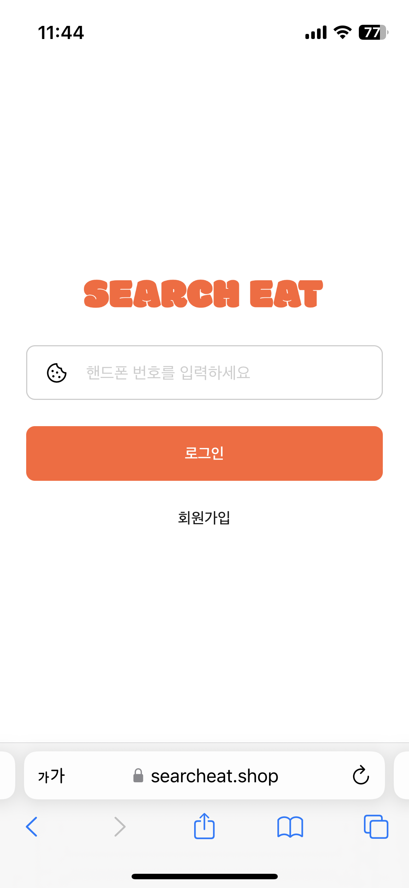
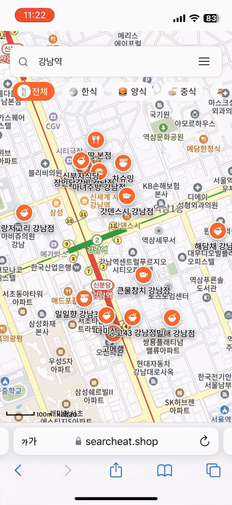
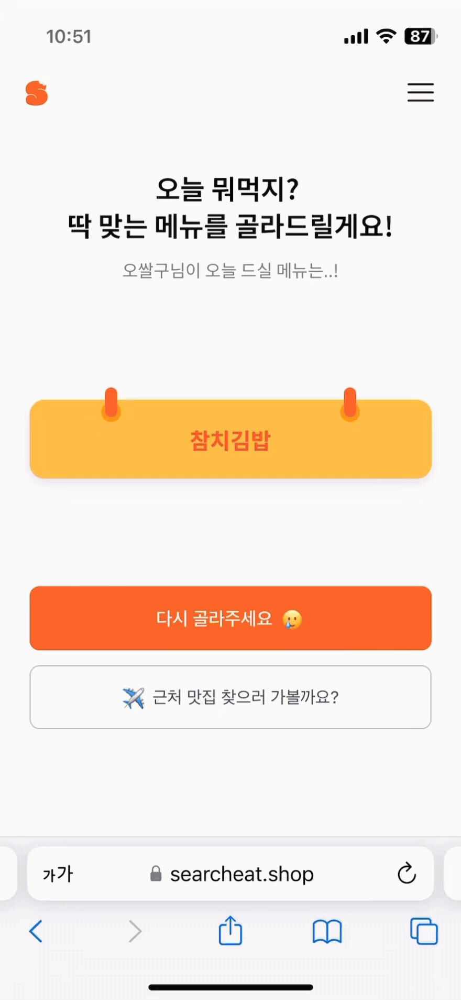
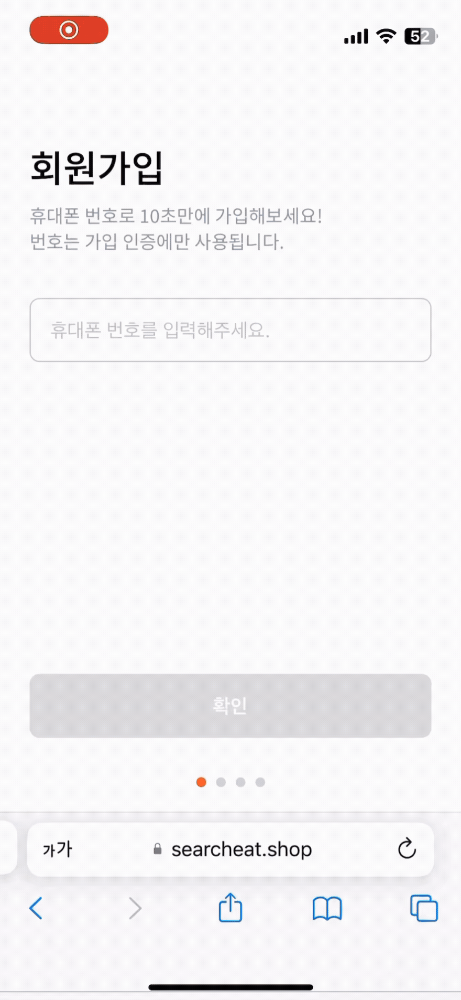
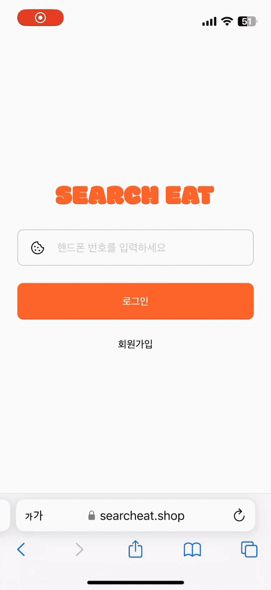
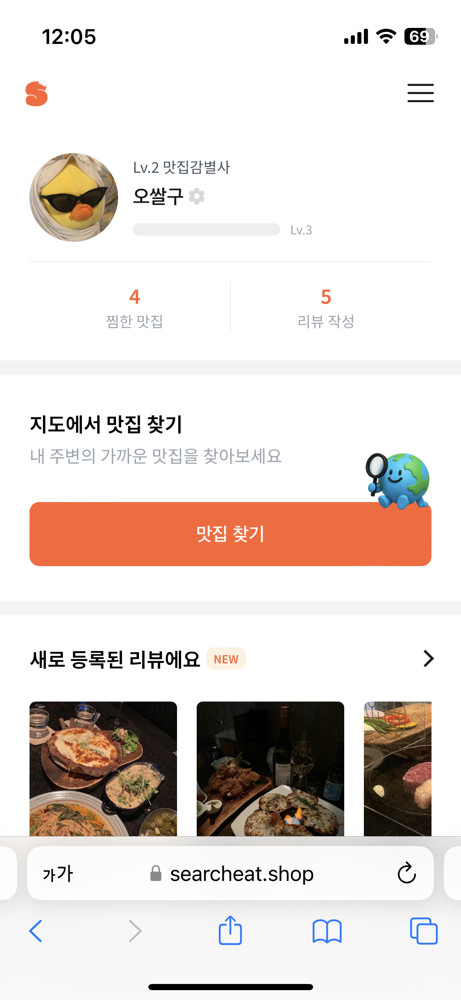
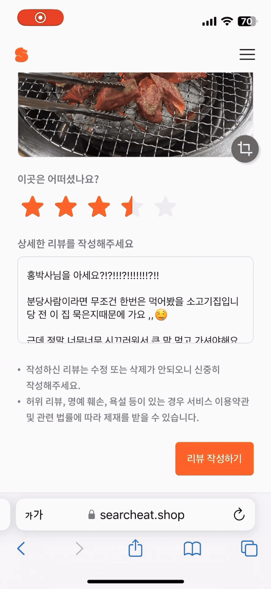
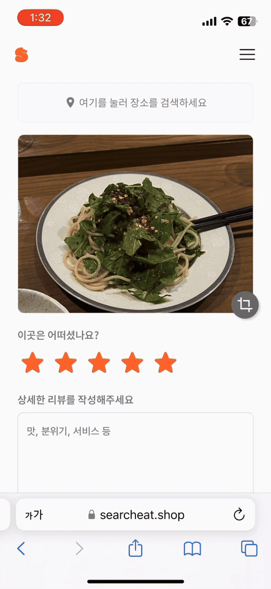
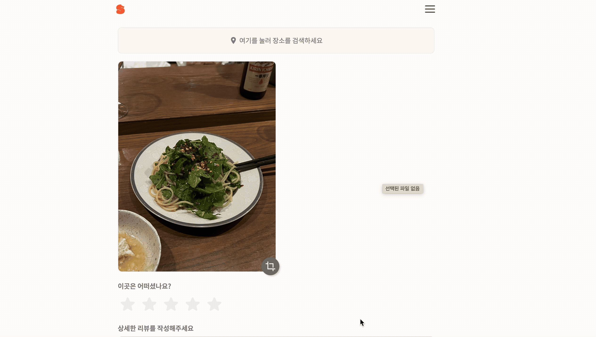
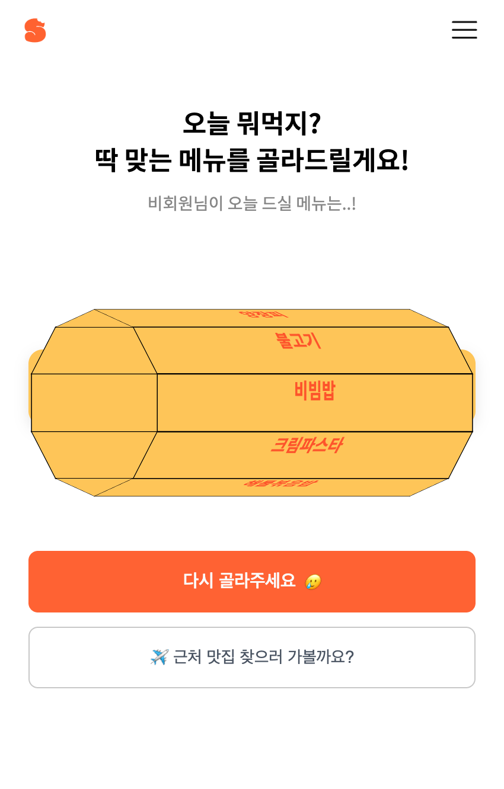

# 🍔 Search Eat: 서치 잇

> **개발기간**: 2025.06.14 ~ 2025.06.20 (약 7일)  
> **개발인원**: 1명(개인 프로젝트)

## 🍔 프로젝트 소개

**"Search Eat: 서치 잇"** 은 카카오 지도 API를 기반으로 **사용자의 현재 위치 또는 특정 지역의 맛집을 검색하고 후기까지 확인할 수 있는 웹 서비스**입니다.

짧은 시간 안에도 가볍게 사용할 수 있도록 **로그인이 필요한 페이지와 자유롭게 접근 가능한 페이지를 구분하고**, 회원가입과 로그인 역시 **비밀번호 없이 인증번호만 입력하는 간편한 방식을 도입하여 접근성을 높였습니다**.

사용자는 로그인 없이도 자유롭게 맛집을 검색하고 다른 사람들의 후기를 열람할 수 있으며, 로그인 후에는 **직접 후기를 작성하거나 찜한 장소를 관리할 수 있습니다.**

#### 🪄 테스트 계정 안내

해당 서비스는 실제 핸드폰 번호를 사용하여 인증번호를 받아야 가입이 가능하기 때문에 아래 계정을 이용해 로그인해주세요 😋

- **핸드폰번호**: 01012345678
- **인증번호**: 12345

<br>

<p align="center">



</p>

## 🍔 기술 스택

| 구분                   | 기술 스택                                                |
| ---------------------- | -------------------------------------------------------- |
| **Frontend**           | Vue 3, Vuex, Vue Router, Sass(SCSS), Vite                |
| **Backend**            | Express.js, JWT (Access/Refresh), Redis, Multer, Cheerio |
| **Infra / DevOps**     | AWS EC2, Nginx, PM2, Certbot (Let's Encrypt)             |
| **Database / Storage** | MySQL, AWS S3                                            |
| **External API**       | Kakao Map API                                            |

<br>

## 1. 회원가입 및 로그인

서비스를 이용할 때 가장 자주 겪는 불편 중 하나는 **"비밀번호가 뭐였더라..?🤔" "내가 뭘로 로그인했지...?🧐"** 하는 순간들입니다.  
SNS, 애플, 이메일 등 다양한 소셜 로그인 방식이 존재하지만, 로그인 방식이 다양해진만큼 선택지가 다양해져 어떤 방법으로 로그인했는지조차 기억하지 못하게 되는 일도 많아졌습니다.

이런 경험은 사용자에게 UX 피로도를 높일 수 있다고 판단하여, 핸드폰 번호 인증 기반의 **'패스워드리스 플로우'** 로 로그인 방식을 단순화했습니다.

1. 전화번호만으로 가입하고 로그인하며,
2. 비밀번호를 만들고 기억할 필요도 없이
3. 내가 어떤 계정으로 회원가입 했는지도 조차도 고민하지 않도록 설계했습니다.

<p align="left">


</p>

### 1-1. 서버 기반 인증처리

- 회원가입 또는 로그인 요청 시 유저 정보를 조회한 뒤 무작위 5자리 숫자를 생성하여 **Redis에 3분간 저장합니다.**
- 인증번호는 단순한 숫자지만 이를 클라이언트에 응답해 비교하게 되면 노출, 토큰 탈취 등의 보안 이슈가 발생할 수 있습니다.
- 따라서, 인증번호는 **서버에서 Redis에 저장하고, 검증도 서버 내에서만 처리**되도록 설계했습니다.

<br>

<details>
<summary><strong>🔐 인증번호 저장 및 문자 발송 코드 보기</strong></summary>

```js
// 인증 번호 생성
const authCode = generateAuthCode()
// Redis에 3분간 저장
await redisClient.setEx(`verify:${phoneNo}`, 180, authCode)
// 인증 문자 발송
const smsResult = await axios.post(process.env.SMS_URL, {
  phone: phoneNo,
  text: `안녕하세요. 인증번호는 [${authCode}] 입니다.`,
  type: 'lms',
})
```

</details>

<details>
<summary><strong>🔐 인증번호 유효성 검증 코드 보기</strong></summary>

```js
const savedCode = await redisClient.get(`verify:${phoneNo}`)
if (!savedCode || savedCode !== code) {
  return res
    .status(400)
    .send({ success: false, msg: '유효하지 않은 인증번호입니다.' })
}
// 인증 성공 시 Redis에서 삭제
await redisClient.del(`verify:${phoneNo}`)
```

</details>

### 1-2. 클라이언트

- 클라이언트는 5자리 분할입력 UI + 자동 포커싱 + 전체 입력 완료 감지로 UX를 단순화했습니다.
- 사용자는 키보드에서 손을 떼지 않고도 인증번호를 빠르게 입력할 수 있으며, 입력이 완료되면 별도 버튼 없이도 자동으로 인증이 진행됩니다.

```js
onInput(index) {
  const val = this.codeInputs[index]
  if (val.length > 1) {
    this.codeInputs[index] = val.slice(0, 1)
  }

  // 다음 input으로 포커스 이동
  if (val && index < 4) {
    this.$refs.inputRefs[index + 1].focus()
  }

  // 모두 입력 완료 → 인증 요청 emit
  if (this.codeInputs.every((v) => v !== '')) {
    const enteredCode = this.codeInputs.join('')
    this.$emit('checkAuthCode', enteredCode)
  }
}
```

## 2. 사용자 상태 관리 및 레벨 시스템

로그인 이후 사용자 정보는 리뷰, 찜, 레벨업 등 여러 기능에서 공통적으로 사용되기 때문에 **앱 전역에서 일관되게 접근할 수 있는 구조**가 필요했습니다.  
따라서 `Vuex + vuex-persistedstate` 를 활용하여 최초 진입 시 유저 정보를 가져와 전역으로 사용하며, 새로고침 후에도 유저 정보가 유지되도록 설계했습니다.

<p align="left">


</p>

### 2-1. 유저 정보 관리 구조

- 최초 로딩 시 (Home.vue 진입 시) getUser() 액션을 실행하여 서버에서 유저 정보를 조회합니다.
- Vuex의 user 모듈에 상태를 저장하고 `createPersistedState`로 상태를 보존합니다.
- 이렇게 저장된 사용자 정보는 프로필, 리뷰, 찜 목록, 레벨업 등 전반적 사용자 기능에서 참조 가능합니다.

<details>
<summary><strong>👤 Vuex user 모듈 구조 코드보기</strong></summary>

```js
// store/user/index.js
state: () => ({
  user: null,
}),
mutations: {
  setUser(state, payload) {
    state.user = payload
  },
  clearUser(state) {
    state.user = null
  },
},
actions: {
  async getUser({ commit }) {
    const res = await axios.get('/v1/user')
    if (res.status === 200 && res.data.success) {
      commit('setUser', res.data.data)
    } else {
      commit('clearUser')
    }
  },
},
```

</details>

### 2-2. 프로필 + 리뷰 기반 레벨업 시스템

- 프로필에는 유저 정보 (Vuex) 기반으로 닉네임, 프로필 사진, 현재 레벨, 찜/리뷰 수가 표시됩니다.
- 현재 레벨 구간 내에서 작성한 리뷰 수를 기준으로 퍼센티지를 계산하고, 이를 프로그레스바로 시각화합니다.
- 리뷰 작성 이후 사용자 리뷰 개수를 판단하고 레벨 업 조건 충족시 `updateLevel()`을 호출하여 레벨업 화면을 출력합니다.

#### 👤 프로그레스바

```js
progressPercent() {
  const count = this.user?.review_count || 0
  const level = this.user?.level || 1

  if (level >= 4) return 100   // 만렙

  // 각 레벨별로 요구되는 리뷰 개수
  const levelThresholds = {
    1: { max: 5 },
    2: { max: 10 },
    3: { max: 20 },
  }

  // 현재 레벨에서 필요한 리뷰 수
  const { max } = levelThresholds[level]

  // 이전 레벨들에서 누적된 리뷰 수 총합
  const prevLevelTotal = Object.entries(levelThresholds)
    .filter(([k]) => Number(k) < level)
    .reduce((acc, [, v]) => acc + v.max, 0)

  // 현재 레벨 내에서 진행률 계산
  const currentProgress = count - prevLevelTotal
  return Math.min(Math.round((currentProgress / max) * 100), 100)
}
```

<details>
<summary>
<strong>👤 리뷰 작성 후 레벨업 판단 코드 보기</strong></summary>

```js
const updatedCount = user.review_count + 1
const currentLevel = user.level
// 리뷰 별 리뷰 카운트 개수 판단
const nextLevel = getLevelByReviewCount(updatedCount)

if (nextLevel > currentLevel) {
  this.showLevelup = true
  await this.updateLevel(nextLevel)
  this.pendingRedirectId = res.data.id
  return
}
```

</details>

## 3. 지도 기반 맛집 탐색 기능


### 3-1. 카카오 지도 API 연동

처음 서비스를 켜는 순간 사용자는 보통 **내 주변에 뭐가 있지?** 라는 궁금증을 먼저 갖게 됩니다.  
그래서 별도의 조작 없이 자동으로 현재 위치를 중심으로 맛집을 탐색할 수 있도록 카카오 지도 API를 연동했습니다.

- 지도 최초 진입 시 `navigator.geolocation`을 통해 가져온 **현재 위치**를 중심으로 초기화됩니다.
- 이후엔 사용자의 검색어 입력 여부에 따라 검색 로직이 분기되며, `Vuex` 상태를 통해 관련 데이터를 관리합니다.

### 3-2. 검색어 입력 여부에 따른 흐름 분기

`searchPlaces`액션에서는 `location`유무에 따라 **지도 중심이 불안정하게 이동하는 이슈를 방지**했습니다.  
초기 진입 시에는 내 위치 기반으로 맛집이 표시되지만, 이 상태에서 카테고리(한식, 중식 등)를 선택하면 키워드만으로 검색이 이뤄져 **지도 중심이 이동하는 문제**가 발생했습니다.  
이를 방지하기 위해 현재 위치에서 카테고리만 검색 시에는 항상 해당 좌표를 기준으로 검색하도록 분기 처리했습니다.

<details>
<summary><strong>📍 카카오 지도 API 초기화 및 검색 흐름 코드보기</strong></summary>

```js
// 지도 초기화
initMap(callback) {
  this.map = new kakao.maps.Map(container, options)
  this.marker = new kakao.maps.Marker({ map: this.map, position: center })
  this.$spinner.hide()
  // ...
}

// 장소 초기화
initPlaces() {
  ps.keywordSearch('맛집',(data, status) => {
    if (status !== kakao.maps.services.Status.OK) return
    this.markers.forEach(({ overlay }) => overlay.setMap(null))
    this.markers = []
    // ...
  })
}

// location 유무에 따라 검색 흐름 분기
if (location) {
  const center = new kakao.maps.LatLng(location.lat, location.lng)
  ps.keywordSearch(keyword, handleSearchResult, {
    location: center,
    radius: 2000,
    sort: 'distance',
  })
} else {
  ps.keywordSearch(keyword, (result) => {
    const center = new kakao.maps.LatLng(result[0].y, result[0].x)
    ps.keywordSearch(keyword, handleSearchResult, {
      location: center,
      radius: 2000,
    })
  })
}
```

</details>

### 3-3. 바텀시트 인터랙션 설계

마커를 터치한 뒤 상세정보를 확인할 수 있도록 앱처럼 동작하는 바텀시트 인터랙션을 구현했습니다.  
특히 모바일 환경에서는 **사용자의 터치 위치와 방향에 따라 시트의 동작 여부를 판단**해 보다 부드러운 UX를 이끌어냈습니다.

- 바텀시트는 모바일에서 드래그 시 화면 하단에서 부드럽게 슬라이드되며, `touchStart`/`touchMove`/`touchend` 이벤트를 통해 수동으로 위치를 제어합니다.
- `canUserMoveBottomSheet()` 함수 내부에서
  - 현재 시트 위치 (getBoundingClientRect().y)
  - 터치 방향 (up, down)을 종합적으로 판단해 시트가 이동 가능한 상황인지 결정합니다.
- 드래그 방향에 따라 시트는 **최상단(MAX_Y) 또는 최하단(MIN_Y)** 으로 자연스럽게 이동하며, **데스크탑 환경에서는 `touch`이벤트가 동작하지 않기 때문에 항상 고정된 위치에 열리도록** 설계해 디바이스 환경에 따라 인터랙션을 구분했습니다.

```js
const MIN_Y = 60
const MAX_Y = window.innerHeight - 260

const canUserMoveBottomSheet = () => {
  const { touchMove, isContentAreaTouched } = metrics.value
  if (!isContentAreaTouched) return true
  if (sheet.value?.getBoundingClientRect().y !== MIN_Y) return true
  return touchMove.movingDirection === 'down'
}

const handleTouchMove = (e) => {
  const currentY = e.touches[0].clientY
  const delta = currentY - metrics.value.touchStart.touchY
  const nextY = metrics.value.touchStart.sheetY + delta

  if (canUserMoveBottomSheet()) {
    e.preventDefault()
    sheet.value.style.transform = `translateY(${
      Math.max(MIN_Y, Math.min(nextY, MAX_Y)) - MAX_Y
    }px)`
  }
}
```

### 3-4. 찜하기: 사용자 상태 기반 조건 렌더링

- 바텀시트 내부에서는 **로그인 여부와 사용자의 찜 목록** 에 따라 UI가 동적으로 바뀌도록 설계했습니다.
- 찜 추가/삭제 시 Vuex store의 `favorite_places` 배열을 함께 업데이트하여 UI와 상태를 실시간으로 동기화합니다.

```js
const isLiked = computed(() => {
  if (!user.value || !Array.isArray(user.value.favorite_places)) return false
  return user.value.favorite_places
    .map(Number)
    .includes(Number(props.selectedData?.id))
})
```

- 다만, Vue는 React처럼 상태 변경이 자동으로 감지되는 구조가 아니기 때문에 `user.favorite_places`에 값을 직접 푸시(push) 하는 방식으로는 반응성이 발생하지 않았습니다.
- 따라서 다음과 같이 **새 배열을 재할당**하는 방식으로 구현하여 Vue의 반응성 시스템이 상태 변화를 감지하도록 처리했습니다.

```js
user.value.favorite_places = [
  ...user.value.favorite_places.map(Number),
  Number(place.id),
]
```

## 4. 맛집 리뷰 작성하기

- 지도 바텀시트에서 '리뷰쓰기' 버튼을 누르면 `placeData`를 Vuex 스토어에 저장하고 리뷰 작성 페이지로 이동합니다.
- 저장된 `placeData`가 존재할 경우 해당 장소 정보가 상단에 표출되며, 없을 경우(사이드바에서 접근) 사용자에게 장소 검색을 유도합니다.




### 4-1. 이미지 미리보기 및 크롭

- 리뷰 사진 업로드 시 미리보기를 제공하고 수정(크롭)기능도 함께 제공했습니다.
- **데스크톱 환경에서는 canvas API를 이용해 수동 크롭을 구현**했고, **모바일에서는 터치 이슈**로 인해 `vue-cropperjs`를 활용한 자동 크롭 UI를 적용했습니다.

- **데스크톱 이미지 크롭 - Canvas 기반 수동 드래그 영역 설정**
  - `mousedown`, `mousemove`, `mouseup` 이벤트를 활용해 드래그 박스를 그리고, 이를 기준으로 원본 이미지를 자르고 새로운 canvas에 렌더링
  - canvas 위에서 마우스를 눌러 시작 지점 기록 → 움직이며 사각형 렌더링 → 마우스 떼면 최종 크롭
  - 사용자의 드래그 방향이나 영역에 따라 가로/세로 비율 자동 계산

<details>
<summary><strong>📷 Canvas 기반 수동 크롭 코드 보기</strong></summary>

```js
this.vueCanvas.addEventListener('mousedown', (e) => {
  this.startX = e.clientX - this.canvasX
  this.startY = e.clientY - this.canvasY
  this.isStart = true
})

this.vueCanvas.addEventListener('mousemove', (e) => {
  if (!this.isStart) return
  this.endX = e.clientX - this.canvasX
  this.endY = e.clientY - this.canvasY
  this.vueCtx.clearRect(0, 0, this.canvasWidth, this.canvasHeight)
  this.vueCtx.strokeRect(
    this.startX,
    this.startY,
    this.endX - this.startX,
    this.endY - this.startY,
  )
})
```

</details>

### 4-2. 이미지 업로드: Canvas → File 변환 후 S3 업로드까지

- 사용자가 업로드한 이미지 파일은 file 형태로 서버에 전송되며 서버에서는 `multer`로 이미지 파일을 메모리에 담고, `@aws-sdk/client-s3`를 통해 S3에 업로드한 뒤 이미지 URL만 DB에 저장하도록 구현했습니다.
- 문제는 Canvas 기반 Crop기능을 구현한 후 **Canvas 위에 그려진 이미지 데이터를 다시 "파일" 형태로 변환해서 서버로 보내야 하는 구조** 였습니다.

**😲 처음엔 toDataURL()로 문자열을 뽑아봤지만...**

- `canvas.toDataURL()`을 사용하면 base64로 인코딩된 문자열을 얻을 수 있어 img 태그의 `src`로는 쓸 수 있지만, 이를 바로 `FormData`로 전송할 수는 없었습니다.

- 결국 다음과 같은 흐름으로 처리해야 했습니다:

```js
toDataURL() → base64 디코딩 → Blob 생성 → File로 변환 → FormData에 append → 서버 전송
```

- 그런데 base64 인코딩된 data URL 문자열을 얻는 것까지는 구현했지만, 이를 다시 `File`로 변환하는 과정이 문제였습니다.
- 몇시간의 사투 끝에 드디어 감을 잡게 된게 **"File은 Blob을 상속받은 객체니까... 어? 그럼 Blob을 File로 감싸면 되지 않나? 🫨"**

```js
File: Blob을 상속 받는 객체로, 주로 "파일 형태"의 바이너리 데이터(mp3, png 파일 등)를 다룬다.
```

- 결국 아래와같이 Blob으로 변환한 뒤 이를 다시 `File` 객체로 생성하여 서버로 전송하는 방식으로 전환하여 해결하였습니다.

```js
const url = this.modiCanvas.toDataURL('image/webp')
this.editUrl = url

const fileName = 'canvas_img_' + new Date().getMilliseconds() + '.webp'

const decodImg = atob(url.split(',')[1])
let array = []
for (let i = 0; i < decodImg.length; i++) {
  array.push(decodImg.charCodeAt(i))
}

const file = new File([new Uint8Array(array)], fileName, { type: 'image/webp' })
```

### 4-3. 별점

- Vue는 React처럼 **모든 상태 변화가 즉각적으로 re-rendering되는 구조가 아니기 때문에** 마우스 위치에 따라 별이 채워지는 비주얼을 구현하려면 수동적인 방식이 필요했습니다.
- 별점 컴포넌트는 마우스 `mousemove`, `click`, `mouseleave` 이벤트를 바인딩하고, DOM 요소의 위치(`getBoundingClientRect()`)와 마우스 좌표를 비교해 0.5 단위 별점 상태를 계산합니다.
- 계산된 값은 상태(`hoverRating`, `rating`)로 관리되며, 각 별의 채워진 정도는 `getFillPercent()`로 계산하여 실시간으로 시각화했습니다.

```js
handleMouseMove(event, index) {
  const { left, width } = event.currentTarget.getBoundingClientRect()
  const offsetX = event.clientX - left
  const isHalf = offsetX < width / 2
  const hoverValue = isHalf ? index - 0.5 : index
  this.setHover(hoverValue)
}
```

## 5. 맛집 리뷰 게시판

- 유저들이 작성한 리뷰들을 보여주는 게시판에서는 `카테고리 필터링 + 무한 스크롤`을 적용하여 서버의 응답 부하를 줄이고 클라이언트 렌더링 부담을 최소화하고자 했습니다.
- 선택된 카테고리에 따라 `GET /v1/board/category`로 요청을 보내고, **스크롤이 일정 위치 이상 내려가면** 추가 데이터를 자동으로 불러오도록 구현했습니다.

<details>
<summary><strong>무한 스크롤 트리거</strong></summary>

```js
const scrollY = el.scrollTop
const visible = el.clientHeight
const scrollHeight = el.scrollHeight

if (scrollY + visible >= scrollHeight - 300) {
  this.getBoard()
}
```

</details>

## 6. 오늘 뭐먹지?

사용자의 식사 결정 피로를 줄이기 위해 3D 회전 애니메이션으로 구성된 메뉴 추천 기능을 제공했습니다.  
Vue에서 DOM 트리거 기반 애니메이션을 제어하는 데 어려움이 있었지만, `key 변경` 및 `nextTick`을 조합하여 유사 슬롯머신 효과를 구현했습니다.

<p align="left">


</p>

### 6-1. 3D 회전 구조와 회전 각도 제어

- 메뉴 추천 리스트는 li 요소를 회전시켜 원기둥 형태로 배치하여 슬롯머신처럼 보이도록 구현했습니다.
- 핵심은 `transform: rotateX()`로 각도를 분할하고, `translateZ()`를 통해 화면 바깥으로 밀어내는 방식을 사용했습니다.
- `rotateX`는 회전 각도를 의미하며, 전체 요소 개수만큼 360°를 나누어 적용합니다.
- `translateZ(75px)`는 각 슬롯 요소를 회전 중심축에서 일정 거리만큼 떨어뜨려 배치하는 역할을하게하여, 각 `li`를 원 중심에서 바깥으로 밀어내는 역할을 하게했습니다.

```js
getItemStyle(index) {
  const deg = index * (360 / this.displayedMenus.length)
  return {
    transform: `rotateX(${deg}deg) translateZ(75px)`,
  }
}
```

### 6-2. 슬롯머신처럼 다시 돌리기

- 슬롯머신은 `isRolling`을 `false → true`로 전환해 CSS 애니메이션을 트리거하는 방식을 사용했습니다.
- 그런데 다시 한 번 슬롯머신을 돌릴 때 `false→true` 변화를 감지시키려면 **`false`상태가 실제 DOM에 먼저 반영된 다음** 다시 true로 바꿔야만 애니메이션이 재실행됩니다.
- 따라서 아래와 같이 `this.rollingKey++`로 강제 리렌더링을 유도하고 `$nextTick()`을 사용하여 false 상태가 반영된 직후에 true로 변경되도록 처리했습니다.

```js
  rollSlot() {
    this.shuffleMenus() // 다시 고를 때마다 섞기
    this.isRolling = false
    this.rollingKey++ // 강제 DOM 리렌더링 유도
    // 다시 트리거되게 만들기 위해 재활성화
    void this.$nextTick(() => {
      this.isRolling = true
    })
  }
```

## 7. 마이페이지

마이페이지에서는 닉네임 수정 및 프로필 사진 변경, 내가 쓴 리뷰, 찜한 맛집들을 볼 수 있습니다.


### 7-1. 찜한 맛집 리스트 관리

- 카카오 지도 API에서는 장소 이미지를 제공하지 않기 때문에 찜한 맛집이 어떤 곳이었는지 기억하기 쉽도록 **네이버 검색 결과를 크롤링하여 자동으로 썸네일 이미지를 가져와 시각적으로 구성**했습니다.
- 서버에서는 이 이미지를 각 장소의 `thumbnail` 필드로 반환하고, 프론트(Vue)에서는 fallback 이미지를 함께 처리하여 **UX 손상을 최소화** 했습니다.

```js
async function getNaverPlaceImage(keyword) {
  const query = encodeURIComponent(keyword)
  const url = `https://search.naver.com/search.naver?query=${query}`

  const { data: html } = await axios.get(url, {
    headers: { 'User-Agent': 'Mozilla/5.0' },
  })

  const $ = cheerio.load(html)
  const imgUrl =
    $('.place_thumb img').first().attr('src') ||
    $('.BkqXt img').first().attr('src') ||
    $('.K0PDV img').first().attr('src') ||
    null

  return imgUrl
}
```

## 👩🏻‍💻 회고 및 느낀점

이번 프로젝트는 Vue 기반의 CSR SPA 아키텍처로 구성되었으며, React 기반 SSR 프로젝트에 익숙했던 제게는 꽤 도전적인 경험이었습니다.  
Vue는 거의 1년 반 만에 다시 다뤄본 것이었고, 컴포넌트 구조나 반응성 개념 자체가 React와는 다르다 보니 단순히 문법이 아니라 사고방식을 다시 적응해야 했습니다.

### 🫠 React만 쓰다가 Vue를 다시 쓸 때 느낀 점

사실 Vue는 한동안 손에서 놓고 있었던 터라 이번 프로젝트는 거의 **Vue 리마인드 + 실전 복귀전**에 가까웠습니다.  
익숙했던 React 기반 개발 습관들이 그대로 남아 있어서 초기에는 “이건 왜 안 되지?”, “왜 반응성이 안 생기지?” 하는 부분에서 고전을 면치 못했습니다.  
React는 상태만 바꾸면 알아서 재렌더링되기 때문에 **비즈니스 로직에만 집중할 수 있는 구조**였다면, Vue는 특히 **DOM 기반 인터랙션에서 수동적인 제어가 필요**한 경우가 많았습니다.

예를 들어:

- `ref`로 바꿨는데도 화면이 반응하지 않아서 당황했다가 `reactive` vs `ref` 차이를 다시 공부하게 됐고,
- Vue는 state를 직접 변경해도 무조건 반응성이 생기지 않기 때문에 `array.push()`처럼 단순하게 처리하면 UI가 갱신되지 않는 점도 잊고 있었습니다.
- 별점 컴포넌트나 바텀시트 인터랙션, 슬롯머신 회전 등에서 직접 `getBoundingClientRect()`를 호출하고, **애니메이션 타이밍을 조절**해야 했던 점은 난이도가 높았지만 동시에 그만큼 Vue의 유연함을 체감할 수 있었습니다.
- 특히 `nextTick`, `key 변경`, `style.transform` 직접 조작 등은 **Vue에서만 가능한 방식으로 문제를 해결해가는 재미**가 있었습니다.

---

### 🫨 CSR vs SSR

사실 그동안 저는 대부분의 웹 프로젝트에서 **SSR(Server Side Rendering)** 을 선호해왔습니다.  
초기 로딩 속도, SEO, 상태 보존 등 여러 측면에서 **SSR은 구조적으로 안정적이고 설계 예측**이 쉬웠기 때문입니다.  
특히 Next.js 기반의 SSR 환경에서 클라이언트 상태와 서버 데이터를 일관되게 유지하는 방식에 익숙해져 있었고, 그 덕분에 CSR 기반의 단일 페이지 앱(SPA) 구조는 오히려 불편하게 느껴지기도 했습니다.

하지만 이번 프로젝트에서는 Vue 기반 CSR SPA 구조를 선택했고, **그 안에서 직접 데이터 흐름과 상태 보존을 설계해야 했기 때문에 구조적으로 많은 고민이 필요했습니다.**

- 유저 정보를 Vuex에 저장하면서도 새로고침 시 유지되도록 `vuex-persistedstate`를 도입해 **CSR 환경의 상태 유지 문제**를 직접 해결해야 했고,
- SSR에서는 페이지 진입 시 자동으로 주입되던 데이터를 CSR에서는 명시적으로 `getUser()`로 불러와야 하기 때문에 **진입 흐름에서의 데이터 누락이나 타이밍 이슈**를 고려해야 했습니다.
- 심지어 간단한 리스트 렌더링에서도 SSR 기반의 초기 렌더링과는 다른 **CSR 특유의 “비동기적 부자연스러움”** 을 체감하면서 그에 맞는 UX 설계가 필요했습니다.

결국 이번 Vue 기반 CSR 프로젝트는 단순히 프레임워크를 바꾸는 경험을 넘어, **"렌더링 구조가 바뀌면 설계 방식도 함께 바뀌어야 한다"는 원칙을 몸소 느낀 계기** 가 됐습니다.

---

### 🍴 설계 고민: 기능보다 "경험 흐름" 중심으로

단순히 맛집을 검색하는 기능만 제공하면 재미가 없을 것 같았습니다.  
그래서 **앱처럼 느껴지게**, 그리고 **사용자가 머무는 이유가 생기게** 만들기 위해 다음의 UX 흐름을 설계했습니다.

- 로그인 없이도 지도 검색과 후기 열람 가능 → 진입 장벽 최소화
- 인증번호 기반 패스워드리스 로그인 → 복잡한 절차 없이 빠른 이용
- 리뷰를 작성하면 레벨업이 되고 → 마이페이지에서 프로필이 성장하는 경험 제공
- 그리고 ‘오늘 뭐먹지?’처럼 심리적 피로를 줄이는 재미 요소도 함께 배치했습니다

서비스 설계의 핵심은 언제나 **“사용자가 지금 이 페이지에서 무슨 생각을 하고 있을까?”** 였고, 그에 따라 각 기능이 배치되고 연결되도록 구성했습니다.

---

### 🍔 마무리하며

이번 프로젝트는 단순히 기술 스택을 바꾸는 것이 아니라, **렌더링 구조에 따른 설계 관점을 전환해볼 수 있었던 좋은 기회**였습니다.😋

Vue를 오랜만에 다시 사용하다 보니 익숙했던 React와의 차이에서 오는 시행착오도 많았지만,  
처음에는 구조적 불편함으로 느껴졌던 부분들도 결국엔 **'설계의 자유도'라는 관점**으로 받아들이게 된 것도 개인적으로 큰 성장이었습니다.

또한, Vue의 반응성과 선언형 스타일이 가지는 강점을 다시금 체감할 수 있었고, CSR 구조에서 오는 명확한 장점과 한계 역시 뚜렷하게 경험할 수 있었습니다.

이번 경험을 바탕으로 앞으로는 SSR 기반 서비스와 CSR 기반 서비스 모두에 **유연하게 대응할 수 있는 개발자**로 나아가는 데 좋은 발판이 되었다고 생각합니다.
